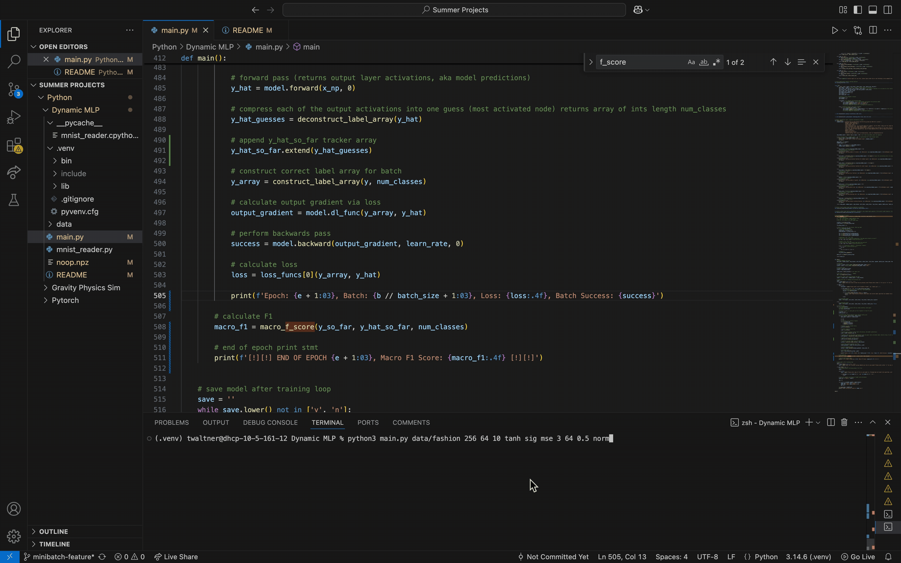

#### Date: September 8th, 2026
#### Contact: waltnertyler@gmail.com | twaltner@u.rochester.edu

# Dynamic CLI Minibatch MLP implemented from Scratch

## Demo: 🎆


## Project Overview:

A fully custom, from-scratch Multi-Layer Perceptron (MLP) engineered in Python and NumPy to classify the FashionMNIST dataset.

Sparked by my Intro to AI course (CSC 242) in Spring 2026, my curiosity for neural networks drove me to look under the hood. Rather than relying on the abstractions of high-level frameworks like PyTorch or TensorFlow, I chose to build this model using minimal external dependencies. This hands-on approach allowed me to deeply absorb the underlying concepts, prioritizing low-level memory optimization, algorithmic efficiency, and a first-hand mathematical implementation of core deep learning mechanics.

---
## Key Engineering & Technical Achievements:

**Systems-Level Memory & Architecture Optimization**

* **Smart State Caching:** Optimized RAM usage by building a custom activation handler that only caches pre-activation values ($z$) for functions that destroy gradients (like ReLU and LeakyReLU).
* **Lightweight Data Shuffling:** Sped up batch sampling by shuffling a lightweight index array (`np.arange`) each epoch instead of copying large, heavy data arrays in memory.
* **He Weight Initialization:** Implemented He weight initialization to prevent vanishing or exploding gradients, which helped stabilize training across deeper networks.
* **Custom Evaluation Metrics:** Wrote a custom Macro F1 score calculator from scratch to get a more accurate read on multi-class predictions, rather than relying solely on loss.
* **Modular Architecture:** Designed the network to easily swap out different activation functions (Sigmoid, Tanh, ReLU, LeakyReLU) and loss functions (MSE, MAE).
* **CLI Configuration:** Set up a command-line interface to easily configure hyperparameters on the fly, including batch size, learning rate, and feature scaling.
* **State Persistence:** Added save/load functionality for weights and biases using `.npz` dictionaries so training can be paused, resumed, or deployed for inference without having to retrain.
* **Data Pipeline:** Built feature scaling (normalization and standardization) directly into the pipeline to speed up model convergence.

**Algorithmic & Mathematical Implementation**

* **Manual Backpropagation:** Wrote the forward and backward passes completely from scratch using raw NumPy matrix multiplication, manually applying chain-rule calculus and gradient descent.
* **Optimized Calculus:** Streamlined backpropagation by computing the bias gradient ($\frac{\partial C}{\partial b}$) first, then reusing it to efficiently find the weight gradient ($\frac{\partial C}{\partial w}$) to avoid redundant math.
* **Pure Vectorization:** Stripped out slow Python for-loops and replaced them with pure NumPy vectorization for calculating activation derivatives and Macro F1 scores, noticeably boosting execution speed.
* **Reusable Skeleton:** Built the project to be highly adaptable; because of the dynamic hidden layers and configurable parameters, this architecture can be easily repurposed for classification tasks way beyond just fashionMNIST.

---

## Technologies Used:  


* **Python 3**: Core application logic.
* **NumPy**: Vectorized matrix operations, linear algebra, and optimized memory management.
* **MNIST Reader**: Dataset intake and parsing.

---

## Run Locally:

### 1. **Clone the repo**
   ```bash
   git clone [https://github.com/twaltner251/Dynamic-MLP.git](https://github.com/twaltner251/Dynamic-MLP.git)
   cd Dynamic-MLP
   ```

### 2. **Run the model via command line specifying parameters**
    python3 main.py <dataset> <hidden_layers...> <num_classes> <hidden_activ> <out_activ> <loss_func> <epochs> <learning_rate> <scaling>
    
### Parameter Breakdown:

- **dataset**: Path to dataset (e.g., `data/fashion`).
- **hidden layers**: Space-separated node counts (e.g., `128 16`).
- **num classes**: Number of output classifications (e.g., `10`).
- **activation funcs**:
    - `sig` or `sigmoid`: Sigmoid
    - `relu`: ReLU
    - `leaky_relu`: Leaky ReLU
    - `smax`: Softmax
    - `tanh`: Tanh
- **loss func**:
    - `mse`: Mean Squared Error
    - `bce`: Binary Cross Entropy
    - `fl`: Focal Loss
- **epochs**: Integer (e.g., `100`).
- **learning rate**: Float (e.g., `0.1`).
- **scaling**:
    - `norm`: Normalization
    - `std`: Standardization

### 3. **Interactive Prompts:**
* **Loading:** It will ask: "Would you like to load from an previous save? Please enter either "y" for yes or "n" for no:". If you select "y", you will need to provide the filepath to a valid .npz file.  
* **Saving:** After the training loop finishes, it will ask: "Would you like to save model? Please enter either "y" for yes or "n" for no:". If you select "y", simply type the desired file name (e.g., my_model), and it will save as an .npz file in your current directory.  

## 📚 Acknowledgements & References

* **3Blue1Brown**: A special shoutout to the phenomenal [Deep Learning YouTube series](https://www.youtube.com/playlist?list=PLZHQObOWTQDNU6R1_67000Dx_ZCJB-3pi). Having visual explanations to these complex topics helped me wrap my head around them better and led to a deeper, intuitive understanding of the linear algebra and calculus driving backpropagation.